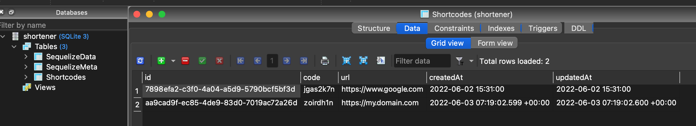

# Url-Shortener

A URL Shortener is a service that creates short aliases for URLs. It generates a shortcode for a URL and then redirects the user to the URL when that code is accessed.

*** <b>You need to have installed Docker, Docker Compose, CURL</b> ***

# How to start the service.
Type the following command
```shell
$ make start
```
Expected output
```shell
docker-compose up -d
Creating network "url-shortener_default" with the default driver
Creating url-shortener_shortener_1 ... done
```

## Check starting service.
Type the following command
```shell
$ docker ps | grep shortener
```

Expected output
```shell
e7f87059c879   url-shortener_shortener   "docker-entrypoint.s…"   3 minutes ago   Up 3 minutes   0.0.0.0:3000->3000/tcp   url-shortener_shortener_1
```

# How to run test.
Type the following command
```shell
$ make test
```

Expected output
```shell
docker-compose exec shortener npm test

> url-shortener@0.0.1 test /app
> NODE_ENV=test jest --coverage --detectOpenHandles --forceExit

 PASS  src/rules/shortcode/validator/index.test.ts
  Validators::Shortcode
    ✓ should return error when url is null (8 ms)
    ✓ should return error when url is empty (1 ms)
    ✓ should return error when url is invalid

 PASS  src/commons/utils/url/index.test.ts
  Utils:Url
    ✓ Should return true for valid test cases (1 ms)
    ✓ Should return false for invalid test cases (4 ms)
    ✓ shouild return valid shortener link (1 ms)

 PASS  src/commons/handlers/index.test.ts
  Controllers:Commons:Handlers:Error
    ✓ should return success response (2 ms)
    ✓ Should return error response

 PASS  src/commons/constants/index.test.ts
  Constants
    ✓ Succes Http (1 ms)
    ✓ Succes Http

 PASS  src/commons/utils/rule/index.test.ts
  Utils:Rule
    ✓ should return same data when does not exist validation errors
    ✓ should return error when input data is not valid (3 ms)

 PASS  src/commons/utils/random/index.test.ts
  Utils:Random
    ✓ should return a valid randome code
```

# How to prepare Database.

## Run migrations/Create tables
Type the following command
```shell
$ make migrate
```
Expected output
```shell
docker-compose exec shortener npx sequelize-cli db:migrate

Sequelize CLI [Node: 14.19.3, CLI: 6.4.1, ORM: 6.12.5]

Loaded configuration file "src/commons/database/config/config.json".
Using environment "development".
== 20220116042802-create-shortcode: migrating =======
== 20220116042802-create-shortcode: migrated (0.106s)
```

## Run seeders/initial data
Type the following command
```shell
$ make seed
```
Expected output
```shell
docker-compose exec shortener npx sequelize-cli db:seed:all

Sequelize CLI [Node: 14.19.3, CLI: 6.4.1, ORM: 6.12.5]

Loaded configuration file "src/commons/database/config/config.json".
Using environment "development".
== 20220116044357-seed-shortcode: migrating =======
== 20220116044357-seed-shortcode: migrated (0.078s)
```
# Endpoints

Once you have created tables and executed migrations we can continue with the following steps.

## Shortcode (GET)

- Method: GET
- Path: /shortcode/:code

Type the following command
```shell
curl --location --request GET 'http://localhost:3000/shortcode/jgas2k7n'
```
Expected output
```shell
{"url":"https://www.google.com"}
```

## Shortcode (POST)

- Method: POST
- Path: /shortcode
- Body: 

Type the following command
```shell
curl --location --request POST 'http://localhost:3000/shortcode' \
--header 'Content-Type: application/json' \
--data-raw '{
    "url": "https://my.domain.com"
}'
```
Expected output
```shell
{"url":"https://short.y/zoirdh1n"}
```

<p align="center"><p align="center">Database Records</p></p>